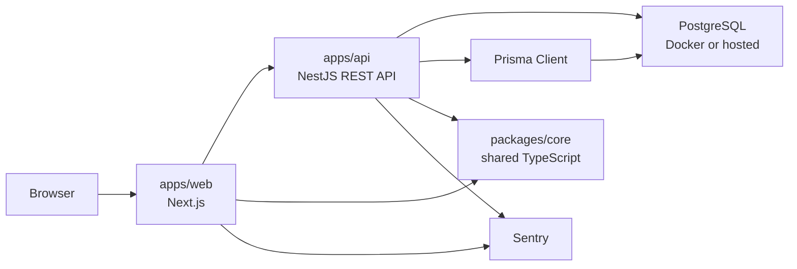
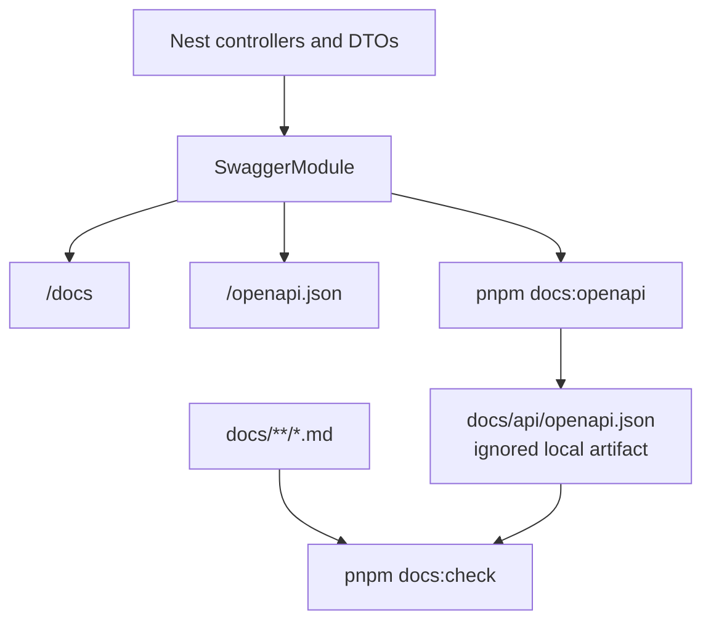

# Architecture

This template is a pnpm workspace with a Next web app, a Nest API, shared packages, and local infrastructure helpers.

## Runtime Shape

- `apps/web` owns the browser-facing Next.js application.
- `apps/api` owns the Nest REST API, Prisma integration, OpenAPI generation, logging, and API observability.
- `packages/core` is reserved for framework-neutral TypeScript shared by apps.
- `infra/docker` contains local development infrastructure.

## Documentation Flow

